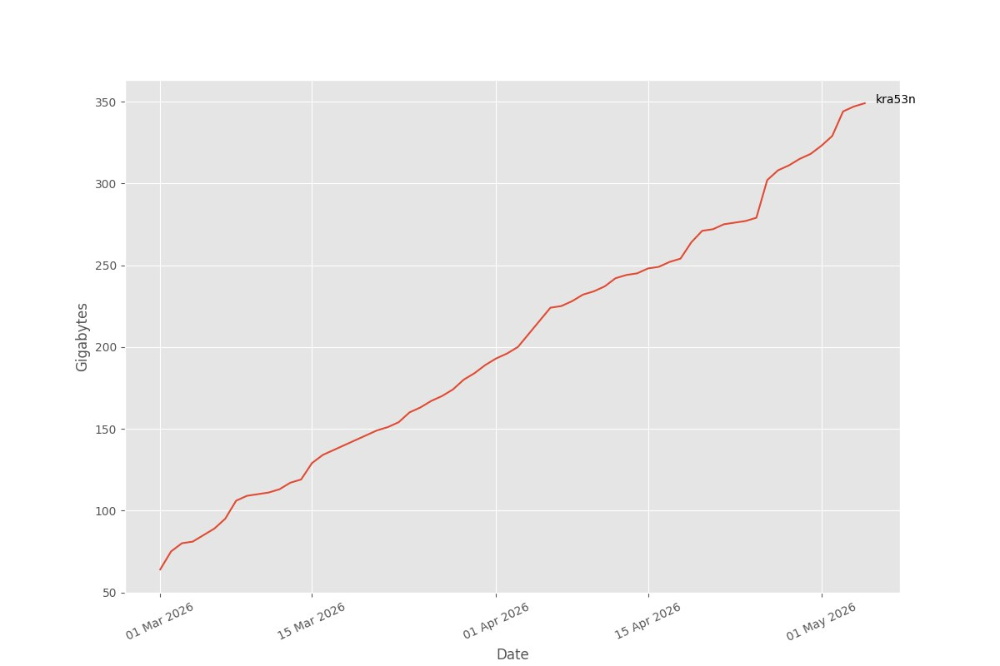

# Traffic stat

Show statistic of proxy usage provided by 3x-ui panel in telegram.



## Usage

> [!NOTE]
> Makefile now is empty and will be filled when setup would requried on a server one more time.
> It is encourouged to send PR with patches! 

```
make setup
```

## Structure

Project written in ***`Go`*** and ***`Python`***.

- ***`Go`*** - collects data from 3x-ui panel and write result to `stat.db`
- ***`Python`*** - run telegram bot and read `stat.db` when bot's users would like to get statistics.